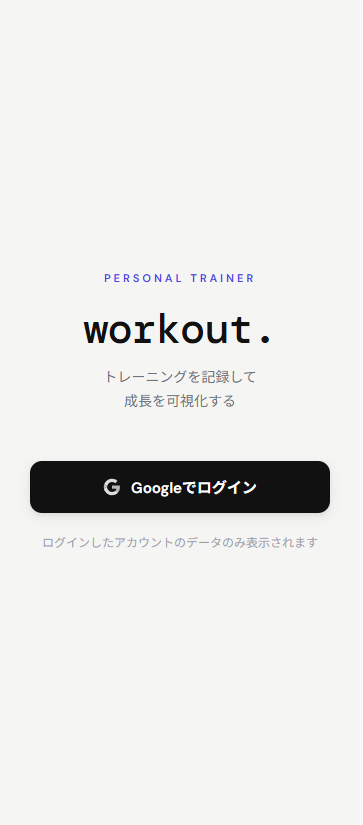
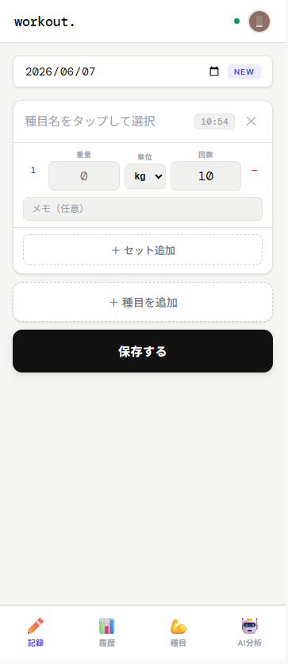
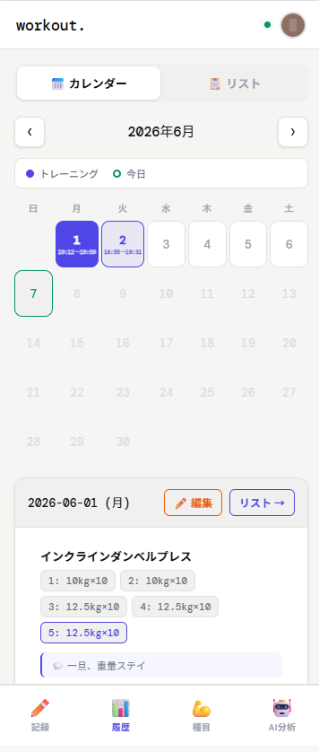
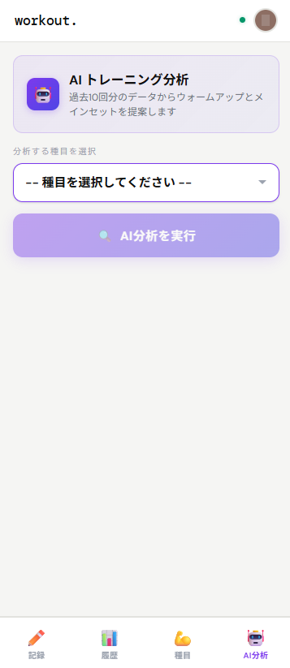
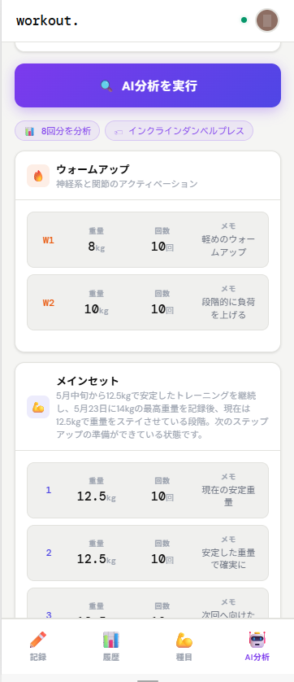
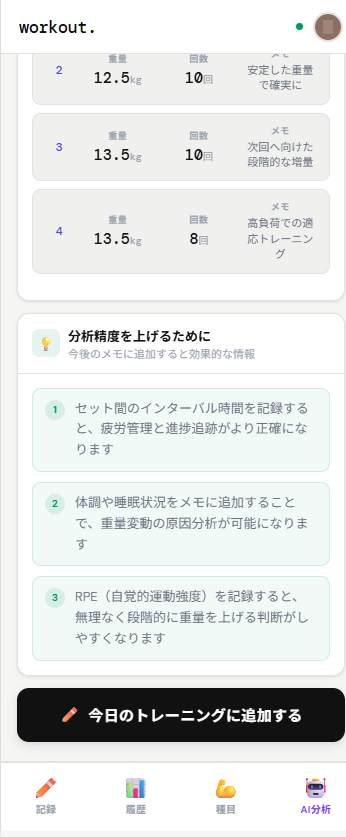
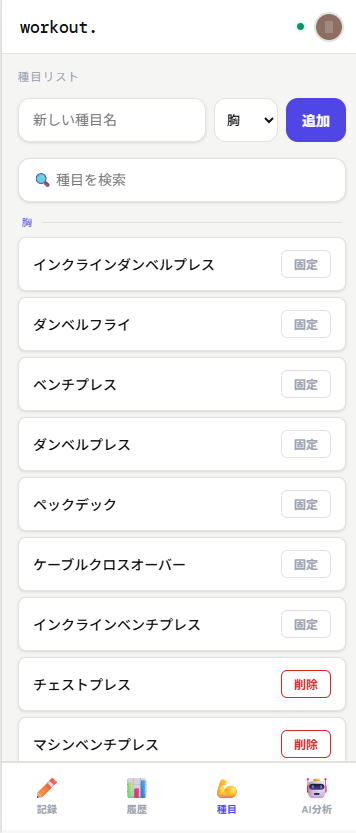

# workout.

## 概要
トレーニング履歴を記録し、AIが次回の推奨重量・セット数を提案するWebアプリ。

## 機能
- Google認証によるログイン
- 種目管理（デフォルト種目＋カスタム種目追加）
- セット数・重量の記録
- カレンダー／リスト形式での履歴確認
- AI分析による次回推奨ウォームアップ・メインセットの提案
- 記録精度向上のための追加メモ項目の提案

## 技術構成
- Frontend: HTML / CSS / JavaScript
- 認証: Firebase Authentication（Google認証）
- DB: Firestore
- AI: Anthropic API（Claude）
- APIキー保護: Cloudflare Workers
- 公開: GitHub Pages

## 設計上の工夫
| 課題 | 対応 |
|------|------|
| APIキーのフロントエンド露出 | Cloudflare Workersを経由してサーバーサイドで管理 |
| AI分析時のトークンコスト増加 | 対象種目の最新10件の履歴のみ送信 |
| 分析精度不足 | AIから追加記録項目を提案する機能を実装 |
| ユーザーデータの分離 | Google認証によりユーザーごとにデータを管理 |
| スマートフォンでの操作性 | ボトムナビゲーション・タップ操作に最適化したUI設計 |
| ホーム画面への追加対応 | PWA対応によりホーム画面から直接起動可能 |
| 画面サイズへの対応 | スマートフォン画面幅に最適化したレイアウト |

## スクリーンショット

## URL
[https://rsm7k2.github.io/workout/](https://rsm7k2.github.io/workout/)
